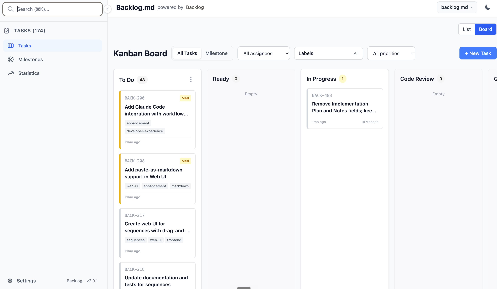

<h1 align="center">Backlog</h1>
<p align="center">Markdown‑native Task Manager &amp; Kanban visualizer for any Git repository</p>

<p align="center">
<code>npm i -g @ugudlado1/backlog</code> or <code>bun add -g @ugudlado1/backlog</code> or <code>nix run github:ugudlado/backlog</code>
</p>


---

> **Backlog** turns any folder with a Git repo into a **self‑contained project board**
> powered by plain Markdown files and a zero‑config CLI.
> Built for **spec‑driven AI development** — structure your tasks so AI agents deliver predictable results.

## Features

- 📝 **Markdown-native tasks** -- manage every issue as a plain `.md` file

- 🤖 **AI-Ready** -- Works with Claude Code, Gemini CLI, Codex, Kiro & any other MCP or CLI compatible AI assistants

- 📊 **Instant terminal Kanban** -- `backlog board` paints a live board in your shell

- 🌐 **Modern web interface** -- `backlog server` launches a sleek web UI for visual task management; `backlog service` runs it as a launchd service on macOS

- 🔍 **Powerful search** -- fuzzy search across tasks, docs & decisions with `backlog search`

- 📋 **Rich query commands** -- view, list, filter, or archive tasks with ease
- ✅ **Definition of Done defaults** -- add a reusable checklist to every new task

- 📤 **Board export** -- `backlog board export` creates shareable markdown reports

- 🔒 **100 % private & offline** -- backlog lives entirely inside your repo and you can manage everything locally

- 💻 **Cross-platform** -- runs on macOS, Linux, and Windows

- 🆓 **MIT-licensed & open-source** -- free for personal or commercial use

---

##  Getting started

```bash
# Install
bun i -g @ugudlado1/backlog
# or: npm i -g @ugudlado1/backlog

# Configure the global store once (where all projects live)
mkdir -p ~/.config/backlog
echo 'globalStore: ~/.config/backlog/projects' > ~/.config/backlog/config.yml

# Create a project (you can run this from anywhere)
backlog project create "My Awesome Project"
# optional: choose a task-id prefix with --prefix <letters>
```

Then wire your AI tool to Backlog over MCP (once per machine):

```bash
backlog mcp install <claude|codex|gemini|kiro>
```

This configures the chosen client to talk to the Backlog MCP server. You can also follow the manual MCP steps in the [MCP Integration](#-mcp-integration-model-context-protocol) section below. Prefer to skip AI entirely? Just use Backlog as a task manager from the CLI or web UI.

Every project is stored as a slot in the configured **global store** (`globalStore` in `~/.config/backlog/config.yml`) — one directory per project, keyed by name, not tied to any repo. Tasks remain human-readable Markdown files (e.g. `task-10 - Add core search functionality.md`). List and switch projects with `backlog project list` / `backlog project switch <name>`, or target one per command with `--project <name>`.

---

### Working with AI agents

This is the recommended flow for Claude Code, Codex, Gemini CLI, Kiro and similar tools — following the **spec‑driven AI development** approach.
After creating a project (`backlog project create`) and wiring your AI tool with `backlog mcp install <client>`, work in this loop:

**Step 1 — Describe your idea.** Tell the agent what you want to build and ask it to split the work into small tasks with clear descriptions and acceptance criteria.

**🤖 Ask your AI Agent:**

> I want to add a search feature to the web view that searches tasks, docs, and decisions. Please decompose this into small Backlog tasks.

> [!NOTE]
> **Review checkpoint #1** — read the task descriptions and acceptance criteria.

**Step 2 — One task at a time.** Work on a single task per agent session, one PR per task. Good task splitting means each session can work independently without conflicts. Make sure each task is small enough to complete in a single conversation. You want to avoid running out of context window.

**Step 3 — Plan before coding.** Ask the agent to research and write an implementation plan in the task. Do this right before implementation so the plan reflects the current state of the codebase.

**🤖 Ask your AI Agent:**

> Work on BACK-10 only. Research the codebase and write an implementation plan in the task. Wait for my approval before coding.

> [!NOTE]
> **Review checkpoint #2** — read the plan. Does the approach make sense? Approve it or ask the agent to revise.

**Step 4 — Implement and verify.** Let the agent implement the task.

> [!NOTE]
> **Review checkpoint #3** — review the code, run tests, check linting, and verify the results match your expectations.

If the output is not good enough: clear the plan/notes/final summary, refine the task description and acceptance criteria, and run the task again in a fresh session.

---

### Working without AI agents

Use Backlog as a standalone task manager from the terminal or browser.

```bash
# Create and refine tasks
backlog task create "Render markdown as kanban"
backlog task edit BACK-1 -d "Detailed context" --ac "Clear acceptance criteria"

# Track work
backlog task list -s "To Do"
backlog search "kanban"
backlog board

# Work visually in the browser
backlog server --open
```

You can switch between AI-assisted and manual workflows at any time — both operate on the same Markdown task files. It is recommended to modify tasks via Backlog commands (CLI/MCP/Web) rather than editing task files manually, so field types and metadata stay consistent. Tasks can record project-root-relative modified files and later be found with `backlog search --modified-file src/path.ts --plain`.

**Learn more:** [CLI reference](CLI-INSTRUCTIONS.md) | [Advanced configuration](ADVANCED-CONFIG.md)

---

##  Web Interface

Launch a modern, responsive web interface for visual task management:

```bash
# Start the web server (foreground; Ctrl+C to stop)
backlog server

# Open the UI in a browser after start
backlog server --open

# Custom port
backlog server --port 8080
```

### Run as a service (macOS)

`backlog service` runs the Web UI under launchd so it starts on login and restarts on crash.

```bash
backlog service start              # install plist + start on port 6420
backlog service status             # check state, pid, program
backlog service logs               # tail stdout/stderr logs
backlog service stop               # stop, leave plist on disk
backlog service uninstall          # stop and remove plist
```

The service serves the current project (recorded as `current:` in `~/.config/backlog/config.yml`). Switch projects from the project switcher in the web UI; the selection survives restarts.

Linux (systemd) and Windows (Task Scheduler / NSSM) recipes live in [Running Backlog as a Service](SERVICE.md).

**Features:**

- Interactive Kanban board with drag-and-drop
- Task creation and editing with rich forms
- Interactive acceptance criteria editor with checklists
- Real-time updates across all views
- Responsive design for desktop and mobile
- Task archiving with confirmation dialogs
- Seamless CLI integration - all changes sync with markdown files



---

## 🔧 MCP Integration (Model Context Protocol)

The easiest way to connect Backlog to AI coding assistants like Claude Code, Codex, Gemini CLI and Kiro is via the MCP protocol.
Run `backlog mcp install <claude|codex|gemini|kiro>` to wire a client up automatically, or follow the manual steps below.

### Client guides

<details>
  <summary><strong>Claude Code</strong></summary>

```bash
claude mcp add backlog --scope user -- backlog mcp start
```

</details>

<details>
  <summary><strong>Codex</strong></summary>

```bash
codex mcp add backlog backlog mcp start
```

</details>

<details>
  <summary><strong>Gemini CLI</strong></summary>

```bash
gemini mcp add backlog -s user backlog mcp start
```

</details>

<details>
  <summary><strong>Kiro</strong></summary>

```bash
kiro-cli mcp add --scope global --name backlog --command backlog --args mcp,start
```

</details>

Use the shared `backlog` server name everywhere – the MCP server auto-detects whether the current directory is initialized and falls back to `backlog://init-required` when needed.

### Manual config

```json
{
  "mcpServers": {
    "backlog": {
      "command": "backlog",
      "args": ["mcp", "start"],
      "env": {
        "BACKLOG_CWD": "/absolute/path/to/your/project"
      }
    }
  }
}
```

If your IDE can't set the process working directory for MCP servers, set `BACKLOG_CWD` as shown above.
If your IDE supports custom args but not env vars, you can also use `["mcp", "start", "--cwd", "/absolute/path/to/your/project"]`.

> [!IMPORTANT]
> When adding the MCP server manually, consider adding a short note in your CLAUDE.md/AGENTS.md files telling the agent this project uses Backlog.md for task management.
> The server guides connected agents from there: one `get_backlog_context` tool call returns the full workflow instructions, project state, and current task board.

Once connected, agents can also read the workflow instructions via the resource `backlog://workflow/overview` or the `get_backlog_instructions` tool.
Use `/mcp` command in your AI tool (Claude Code, Codex, Kiro) to verify if the connection is working.

---

##  CLI reference

Full command reference — task management, search, board, docs, decisions, and more: **[CLI-INSTRUCTIONS.md](CLI-INSTRUCTIONS.md)**

Quick examples: `backlog task create`, `backlog task list`, `backlog task edit`, `backlog search`, `backlog board`, `backlog server`, `backlog service start`, `backlog project switch` (switch between projects in the global store).

Full help: `backlog --help`

---

##  Configuration

Backlog merges the following layers (highest → lowest):

1. CLI flags
2. Project config file (`config.yml` inside the project's global-store slot)
3. Built‑ins

### Project settings

`backlog project create` ships safe defaults (`defaultPort=6420`, `autoOpenBrowser=true`). The task-id prefix is chosen at create time with `--prefix <letters>`. The rest of the project configuration surface is:

- Definition of Done defaults: project-level `definition_of_done` checklist items.
- Web UI defaults: `defaultPort` and whether `autoOpenBrowser` should run.

Change any of these via the Web UI Settings page or by editing the project config file directly (see below).

Projects live in the global store, not in a Git repo. CLI, Web, and MCP workflows never depend on a Git repository.

### Machine-level config (`~/.config/backlog/config.yml`)

Some settings live outside any project and apply across all repositories on the machine. Create or edit `~/.config/backlog/config.yml` directly — the CLI does not write to this file.

**`globalStore`** — redirect all backlog storage to a single external directory instead of creating a `backlog/` folder inside each code repo:

```yaml
# ~/.config/backlog/config.yml
globalStore: /path/to/my/backlog-store
```

When `globalStore` is set:

- `backlog project create` creates `<globalStore>/<name>/` instead of `<repo>/backlog/`.
- All task reads and writes go to the external slot — the code repo is never touched.
- `git log` in your code repo stays clean.
- The `globalStore` directory must exist before running `backlog project create`. Backlog will not create it.
- If a local `backlog/` or `.backlog/` folder already exists in the repo, it wins and the global store is ignored for that project.

The current `globalStore` value (or `(not set)`) is whatever you have written in `~/.config/backlog/config.yml`.

To override the config directory path (useful in tests or CI), set the `BACKLOG_MACHINE_CONFIG_DIR` environment variable.

### Definition of Done defaults

Set project-wide DoD items in the Web UI (Settings → Definition of Done Defaults), or by editing the project config file directly:

```yaml
definition_of_done:
  - Tests pass
  - Documentation updated
  - No regressions introduced
```

When a project uses root config discovery, edit `backlog.config.yml` instead of `backlog/config.yml`.

These items are added to every new task by default. You can add more on create with `--dod`, or disable defaults per task with `--no-dod-defaults`.

For the full configuration reference (all options and detailed notes), see **[ADVANCED-CONFIG.md](ADVANCED-CONFIG.md)**.

---

## 🌐 Community Tools

- **[vscode-backlog-md](https://marketplace.visualstudio.com/items?itemName=ysamlan.vscode-backlog-md)** - VS Code extension with issues panel, kanban view, and editing. ([ysamlan/vscode-backlog-md](https://github.com/ysamlan/vscode-backlog-md))

---

### Acknowledgments

Forked from [MrLesk/Backlog.md](https://github.com/MrLesk/Backlog.md) by Alex Gavrilescu — thanks for the original work.

### License

Backlog is released under the **MIT License** – do anything, just give credit. See [LICENSE](LICENSE).
